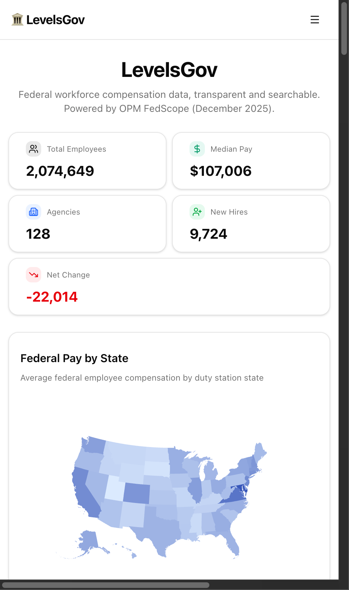
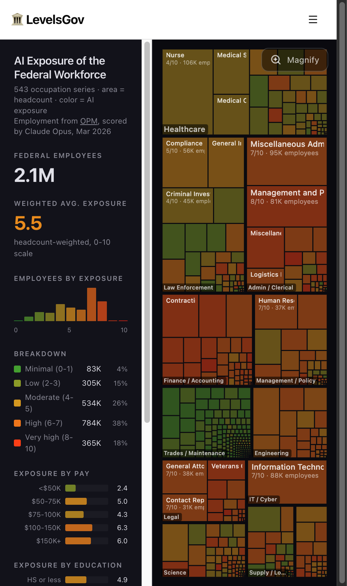
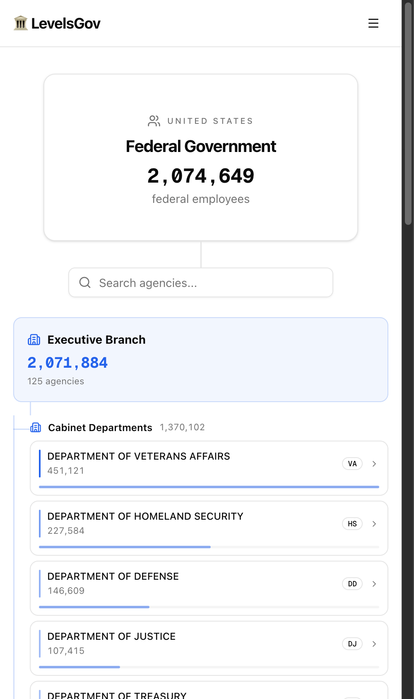
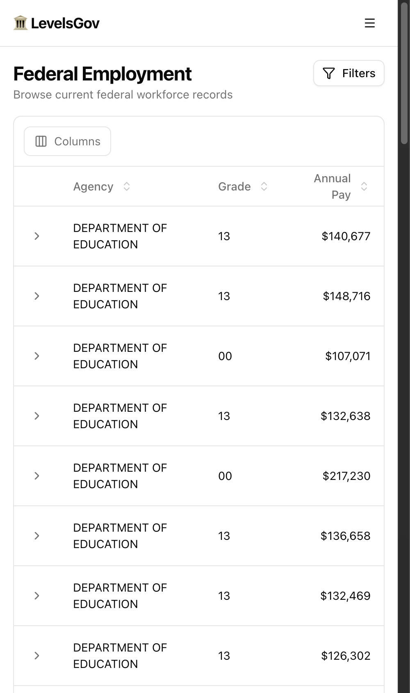

# LevelsGov

**Open-source federal workforce intelligence.** Browse, explore, and visualize U.S. federal employee compensation and workforce data from the Office of Personnel Management (OPM).

**[levelsgov.com](https://levelsgov.com)**

<table>
  <tr>
    <td width="50%"></td>
    <td width="50%"></td>
  </tr>
  <tr>
    <td width="50%"></td>
    <td width="50%"></td>
  </tr>
</table>

---

## What is this?

LevelsGov makes OPM FedScope data accessible and understandable. Instead of downloading bulk CSV files from OPM, you get an interactive dashboard with search, filters, and visualizations covering **2M+ federal employee records** across every agency, occupation, and state.

Think of it as [levels.fyi](https://levels.fyi) but for the federal government.

## Features

### Dashboard
- Key workforce stats: total employees, median pay, agency count, new hires, net change
- Interactive choropleth map of federal pay by state
- Top paying agencies and occupations
- Pay breakdowns by tenure, education, age, and STEM classification
- GS grade distribution, work schedule breakdown, supervisory pay gap
- Workforce trend analysis: separation reasons, agency changes, STEM brain drain

### Employment Browser
- Search and filter the full federal workforce dataset
- Filter by agency, state, occupation, grade, pay plan, education, age, work schedule, and more
- Sortable, paginated results

### New Hires & Departures
- Browse accession and separation records with the same filter capabilities
- Understand who's joining and leaving federal service, and why

### AI Exposure
- Interactive treemap of 500+ federal occupations sized by headcount and colored by AI exposure score
- Demographic breakdowns (age, education) for each occupation
- Custom scoring methodology based on digital work, routine cognition, interpersonal labor, and regulatory criticality

### Org Chart
- Hierarchical view of the federal government structure
- Cabinet departments, military branches, independent agencies, legislative and judicial branches
- Agency subelements with headcount data

## Tech Stack

- **Framework:** Next.js 16 (React 19, TypeScript)
- **Database:** PostgreSQL
- **Styling:** Tailwind CSS v4, shadcn/ui
- **Charts:** Recharts, react-simple-maps
- **Deployment:** Docker, Coolify (self-hosted)

## Getting Started

### Prerequisites

- **Node.js** 20+
- **PostgreSQL** 14+
- **Python** 3.10+ (for the data pipeline)

### 1. Install dependencies

```bash
git clone https://github.com/mishafyi/levelsgov.git
cd levelsgov
npm install
```

### 2. Set up the database

The app connects to PostgreSQL via `DATABASE_URL` (default: `postgresql://localhost:5433/fedwork`). Create the database and load the schema:

```bash
createdb fedwork
psql postgresql://localhost:5433/fedwork -f scripts/schema.sql
```

### 3. Configure environment

Create a `.env.local` in the project root:

```bash
# Postgres connection (omit to use the default above)
DATABASE_URL=postgresql://localhost:5433/fedwork

# Optional: token guarding the on-demand cache-revalidation route (/api/revalidate)
# REVALIDATE_TOKEN=your-secret
```

### 4. Load OPM data

The Python pipeline downloads OPM FedScope files and bulk-loads them into Postgres:

```bash
pip install psycopg2-binary requests
python3 scripts/download.py --months 18   # download + import ~18 months
```

Useful flags: `--dataset employment` (single dataset), `--dry-run` (preview only), `--no-import` (download without importing). To load one file directly, use `python3 scripts/import.py <dataset> <file>`.

### 5. Run the dev server

```bash
npm run dev
```

Open [http://localhost:3000](http://localhost:3000). A `Dockerfile` is included for containerized/self-hosted deployment.

## Data Source

All workforce data comes from the [OPM FedScope](https://www.opm.gov/data/datasets/#checks=employment-full) public dataset. AI exposure scores are generated using a custom methodology documented in the repository.

## License

[MIT](LICENSE)
